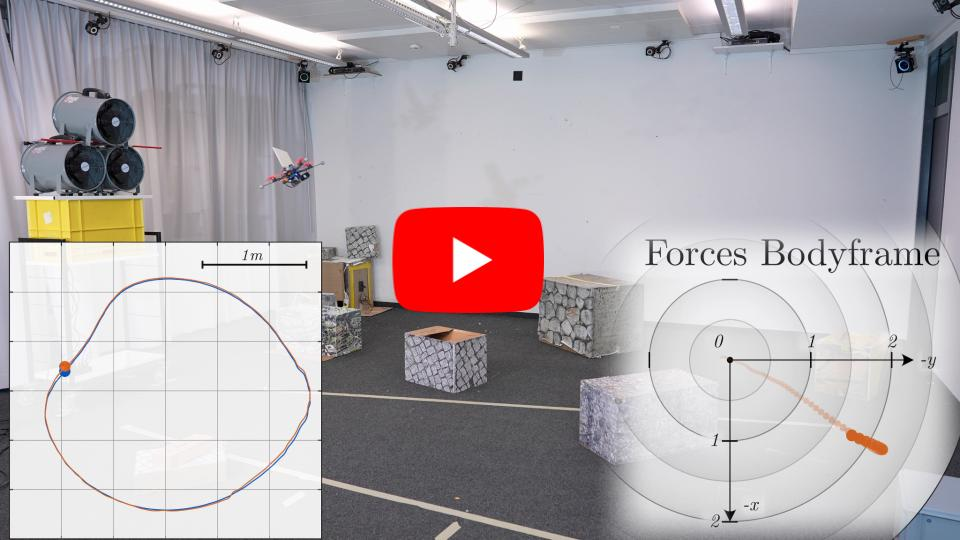
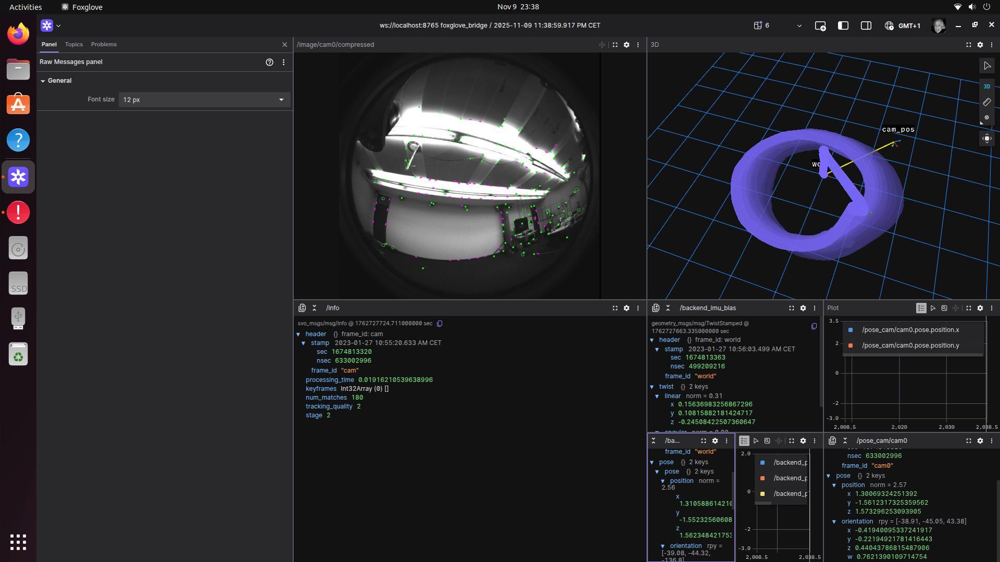

# ROS2 Port of HDVIO2.0: Wind and Disturbance Estimation with Hybrid Dynamics VIO

[](https://www.youtube.com/watch?v=wUaEp0YGpDM)

## Screenshot



This repository contains a ROS2 port of HDVIO2.0, a sliding-window optimization-based odometry system fusing visual, inertial and hybrid quadrotor dynamics obtained by combining a point-mass vehicle model with a learning-based component, with access to control commands and IMU history, to capture complex aerodynamic effects. 

It builds on top of the visual-inertial odometry algorithm [SVO Pro](https://github.com/uzh-rpg/rpg_svo_pro_open). The B-spline implementation is based on this [work](https://openaccess.thecvf.com/content_CVPR_2020/papers/Sommer_Efficient_Derivative_Computation_for_Cumulative_B-Splines_on_Lie_Groups_CVPR_2020_paper.pdf).

## Installation

The code has been tested on:
- Ubuntu 22.04 with ROS2 Humble (x86_64)

### System Dependencies

```sh
# Install ROS2 (Humble recommended)
sudo apt-get install software-properties-common
sudo add-apt-repository universe
sudo apt update && sudo apt install curl -y
sudo curl -sSL https://raw.githubusercontent.com/ros/rosdistro/master/ros.asc | sudo apt-key add -
sudo add-apt-repository "deb [arch=$(dpkg --print-architecture)] http://packages.ros.org/ros2/ubuntu $(lsb_release -cs) main"
sudo apt update
sudo apt install ros-humble-desktop -y

# Install colcon build tools
sudo apt install python3-colcon-common-extensions python3-vcstool

# System dependencies
sudo apt-get install libglew-dev libopencv-dev libyaml-cpp-dev 

# Ceres Solver dependencies
sudo apt-get install libblas-dev liblapack-dev libsuitesparse-dev
```

### Clone and Build

```sh
# Create workspace
mkdir -p ~/hdvio2_ros2_ws/src
cd ~/hdvio2_ros2_ws/src

# Clone repository
git clone https://github.com/TheLukaDragar/hdvio2.0_ros2.git

# Build
cd ~/hdvio2_ros2_ws
colcon build --cmake-args -DCMAKE_BUILD_TYPE=Release

# Source workspace
source install/setup.bash
```

## Running the Code

### Download Example Data

Download the rosbag and network weights from [Google Drive](https://drive.google.com/drive/folders/1zK88WnSwcYOD7A29tu4WDksy6b0HMIC-?usp=sharing). Place the network weights in the folder `hdvio2/net_models`.

**Note:** The bag files are provided in ROS1 format. Convert them to ROS2 MCAP format:

```sh
# Install rosbags utility
pip3 install rosbags>=0.9.11

# Convert ROS1 bag to ROS2 MCAP format
rosbags-convert --src ~/Downloads/flyingroom_flight.bag --dst flyingroom_flight_ros2 --dst-storage mcap
```

### Launch HDVIO2

**Launch HDVIO2 with bag playback:**

```sh
source ~/hdvio2_ros2_ws/install/setup.bash
ros2 launch hdvio2 oghdvio2_launch.py
```

This launch file automatically plays the bag file (`flyingroom_flight_ros2`) along with launching the HDVIO2 node.

### Launch Options

You can customize the launch with various arguments:

```sh
ros2 launch hdvio2 oghdvio2_launch.py \
    calib_file:=realsense \
    vio_param_file:=vio_mono_fisheye \
    use_dynamics:=true \
    quad_name:=parrot \
    record:=false
```

View all available arguments:
```sh
ros2 launch hdvio2 oghdvio2_launch.py --show-args
```

**Note:** For manual bag playback, use `hdvio2_launch.py` and play the bag separately in another terminal.

## Configuration

### Camera Calibration
Located in: `hdvio2/param/calib/`
- `realsense.yaml` - Default RealSense camera configuration

### VIO Parameters  
Located in: `hdvio2/param/`
- `vio_mono_fisheye.yaml` - Monocular fisheye configuration

### TensorRT Models
Located in: `hdvio2/net_models/`
- Place your trained `.engine` files here for dynamics prediction
- `thrust_net_flyingroom.engine` - Thrust prediction model
- `torque_net_flyingroom.engine` - Torque prediction model

## Topics

**Subscribed Topics:**
- `/camera/fisheye1/image_raw` - Camera images
- `/camera/imu` - IMU data  
- `/parrot/agiros_pilot/mpc_command` - Dynamics commands (if enabled)

**Published Topics:**
- `/svo/backend_pose_imu` - Estimated pose
- Various visualization topics for RViz

## ROS2 Migration Notes


## Troubleshooting

### Large Bag Files
Large bag files (>100MB) are excluded from git via `.gitignore`. Always download and convert bags locally rather than committing them to the repository.

### RViz Plugin Errors
If you see errors like "rviz/Orbit could not be found", use the ROS2-compatible config:
```sh
ros2 launch hdvio2 hdvio2_launch.py rviz_config:=rviz_config_vio_ros2.rviz
```

## Credits

The VIO system used in this repo is based on [SVO Pro](https://github.com/uzh-rpg/rpg_svo_pro_open). Check [SVO Pro](https://github.com/uzh-rpg/rpg_svo_pro_open) for the full list of acknowledgments.

Original HDVIO2.0 paper:
- G. Cioffi, L. Bauersfeld, and D. Scaramuzza, "**HDVIO2.0: Wind and Disturbance Estimation with Hybrid Dynamics VIO**," IEEE Transactions on Robotics (T-RO) 2025.

## License

The code is licensed under GPLv3. For commercial use, please contact the authors at cioffi@ifi.uzh.ch and sdavide@ifi.uzh.ch.

Check [SVO Pro](https://github.com/uzh-rpg/rpg_svo_pro_open) for licenses of the external dependencies.
